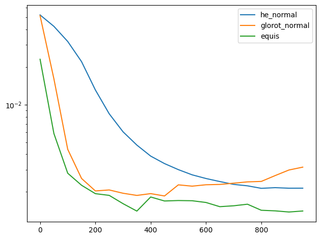

# Sobre la Inicialización de Parámetros #

## Introducción ##
En este proyecto consideramos redes con una capa oculta.

Que en fórmulas pueden ser descritos como:
$$
    N(x) = W \sigma(Lx + b)
$$
donde $x\in \mathbb{R}^{n_0}$, $L \in \mathbb{R}^{n_1\times n_0}$, $b\in\mathbb{R}^{n_1}$
y $W\in \mathbb{R}^{1 \times n_1}$.
La función $\sigma$ es no lineal y actúa por componentes. La llamamos activación.

Llamamos parámetros a $L, b, W$ y se modifican de manera iterativa usando métodos basados en descenso
de gradiente. Surge entonces la pregunta: ¿cómo afecta la inicialización al aprendizaje de la red?

**Observación**
$$
    N(x) = W_1 \sigma(Lx + b)_1 + W_2 \sigma(Lx+b)_2 + \cdots + W_{n_1} \sigma(Lx+b)_{n_1}.
$$
y podemos interpretar $\lbrace \Phi_i(x) = \sigma(Lx+b)_i \rbrace_{i=1}^{n_1}$ como una base y
a $W$ como los coeficientes que representan al objetivo. Por lo tanto, vemos que la **inicialización
de $L$ y $b$ determinan una base**.

> En general, las inicializaciones se hacen escogiendo valores aleatorios siguiendo una distribución
> uniforme o normal.

## Input 1d (o $n_0=1$) ##

Ponemos a prueba las inicializaciones de glorot (normal), he (normal) y equidistante, usando
como función de activación $\mathrm{ReLU}$, $\mathrm{ReLU}^2$ y $\tanh$.
Las bases correspondientes a estas inicializaciones se muestran a continuación, sin ninguna
función de activación.

### PINNs: Laplaciano ###

* Neuronas: 32
* Pérdida: $L(N) = \lVert N(x) - (\cos(2\pi x) - 1) \rVert_{L^2}^2$ y la aproximamos
usando el estimador de MonteCarlo con $1024$ puntos.
* Épocas: 1000
* Optimizador: Adam con *learning rate* $1e-3$.
* Activación: $\mathrm{ReLU}^2$ 

### PINNs: Laplaciano ###

* Neuronas: 10
* Pérdida: $L(N) = \lVert N''(x) + 9\sin(3x) \rVert_{L^2}^2$ y la aproximamos
usando el estimador de MonteCarlo con $200$ puntos.
* Épocas: 5000
* Optimizador: Adam con *learning rate* $1e-3$.
* Activación: Tanh 

|Glorot Normal| He Normal | Equidistant |
|:-:|:-:|:-:|
||||

## Input 2d (o $n_0=2$) ##

* Neuronas: 32
* Pérdida: $L(N) = \lVert N''(x) + y\cos(x) \rVert_{L^2}^2$ y la aproximamos
usando el estimador de MonteCarlo con $1024$ puntos.
* Épocas: 5000
* Optimizador: Adam con *learning rate* $1e-3$.
* Activación: $\mathrm{ReLU}^2$.

# Conclusión #

En nuestros experimentos se observa que la inicialización equidistante presenta mejor
rendimiento en comparación con las inicialización de Glorot y He.
